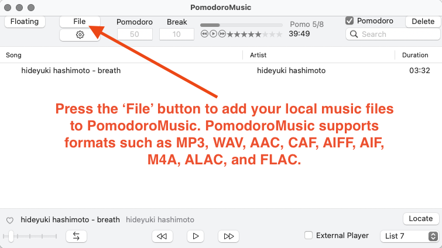
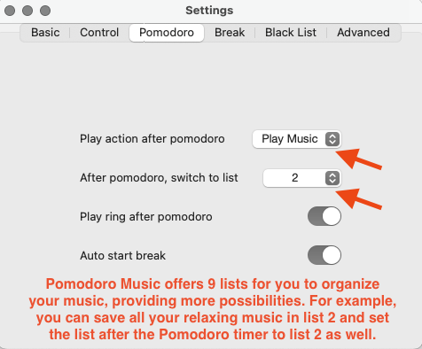
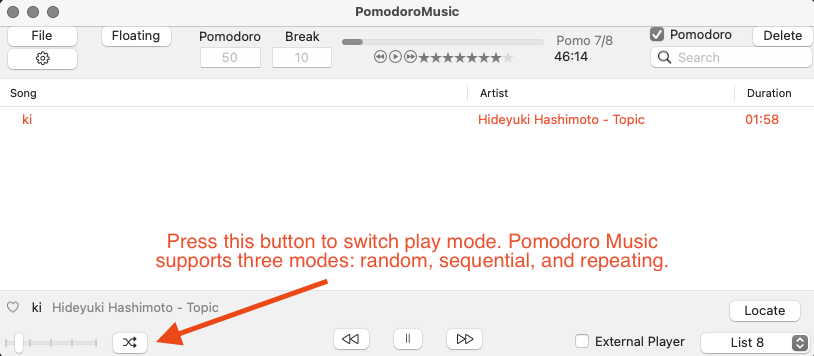
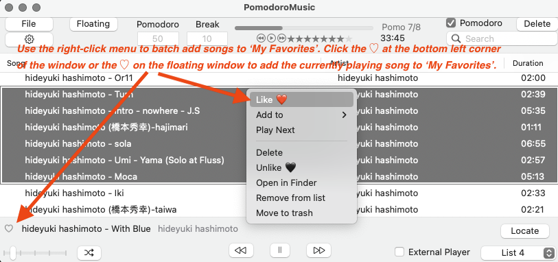
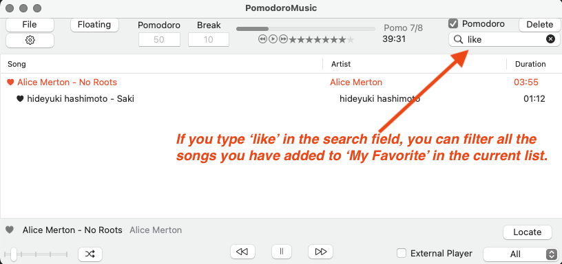
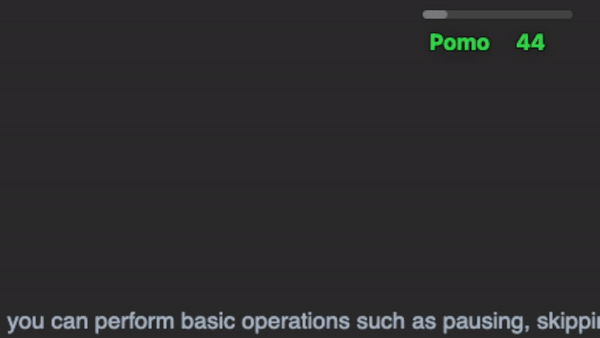
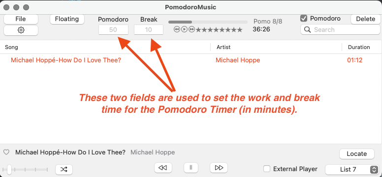
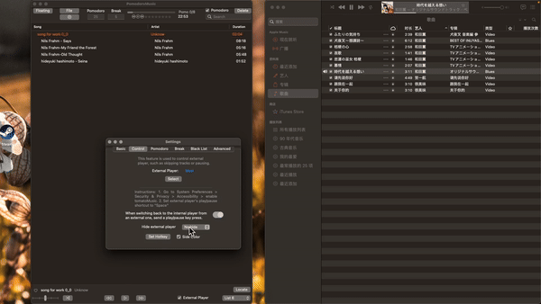

# Pomodoro Music (MacOS)

## Youtube showcase Video: https://youtu.be/E0Z3ON0D1VM

## [Click Here to download](https://github.com/finsterniz/PomodoroMusic/raw/main/PomodoroMusic.dmg)

---

## Table of content
- [Why Pomodoro Music](#why-pomodoro-music)
- [Quick Start Guide](#quick-start-guide)
- [Features](#features)
  - [Music Player](#music-player)
    - [Adding local files](#adding-local-files)
    - [Play List](#play-list)
    - [Play Mode](#play-mode)
    - [Search and Filer](#search&filter)
    - [Add to Favorites](#add-to-favorites)
    - [Floating window](#floating-window)
    - [Menu Bar](#menu-bar)
  - [Pomodoro Timer](#pomodoro-timer)
    - [Timer Settings](#timer-settings)
    - [Actions after Work/Break](#actions-after-work&break)
    - [Software Blacklist](#software-blacklist)
  - [Control other Players](#control-other-players)
    - [Play controls](#basic-control)
    - [Stash](#stash)
---
## Why Pomodoro Music

Do you like using a Pomodoro timer and listening to music while working/studying?

PomodoroMusic is designed just for you!

It combines a music player and a Pomodoro timer, activating focus mode with a single click.

---

## Quick Start Guide
### Step 1: Download
[Click Here](https://github.com/finsterniz/PomodoroMusic/raw/main/PomodoroMusic.dmg)  to download dmg file
### Step 2: Install
Open the dmg file, drag "PomodoroMusic" into "Application" to finish installation.
### Step 3: Run PomodoroMusic
  1.	First, double-click PomodoroMusic in "Application" to open. You might see a prompt indicating that PomodoroMusic is from an unknown developer and cannot be opened.
  2.	Open System Preferences : Click the Apple icon in the upper left corner of the screen, then select “System Preferences.”->	Choose “Security & Privacy.”
  3.	Allow the PomodoroMusic : In the “General” tab of the “Security & Privacy” panel, you will see a message stating that PomodoroMusic was blocked. -> Click the “Open Anyway” button to allow the PomodoroMusic to run.
---

## Features

### Music Player
#### Adding local files

#### Play List

#### Play Mode

#### Add to Favorites

#### Search and Filter

#### Floating window
Using the floating window, you can perform basic operations such as pausing, skipping songs, and adding the currently playing song to ‘My Favorites’. While controlling other player with PomodoroMusic, the floating window can also be used to control.

When your mouse leaves the floating window, it will display the remaining time of the current timer.

#### Menu Bar

The menu bar can be used for play/pause and skipping songs. The play button will change to a number between 0 and 9 when the song starts, indicating the percentage of time remaining on the Pomodoro Timer from 10% to 100%.

---

### Pomodoro Timer

#### Timer Settings

#### Actions after Work/Break

#### Software Blacklist
You can enable the Blacklist feature in Settings. To use this feature, you need to grant PomodoroMusic permission in the ‘Accessibility’ section of your MacOS system settings. Any software added to the Blacklist will be automatically hidden in the background and unclickable during the Pomodoro Timer sessions.

---

### Control other Players
When controlling other players, PomodoroMusic can stash other players to save place for user, function as a Pomodoro Timer with a floating window, allowing the user to conveniently control other players.

#### Play controls

PomodoroMusic performs basic play/skip operations by sending shortcut keys to other software. This method is completely safe and is not a form of malicious hacking. (To use this feature, you need to grant PomodoroMusic permission in the ‘Accessibility’ section of your MacOS system settings.)

#### Stash
You can stash the other music player to the left or right side of the screen. When you move the mouse over it, the player will be unstashed. This makes it convenient for users to operate the player and save screen space. (To use this feature, you need to grant PomodoroMusic permission in the ‘Accessibility’ section of your MacOS system settings.)

